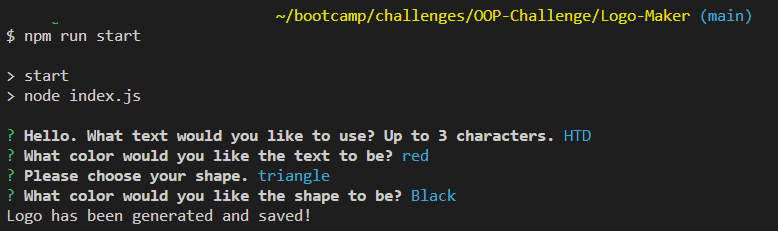

# Logo-Maker
This repository holds the code for my SVG logo maker application. 

## Description
This application is a console-based program which prompts users for design details for a 200x200 SVG logo.

## Usage

Run 'npm i' to install dependencies, then run 'npm run start' to begin the application. You will be asked to enter up to 3 characters which you would like to appear on the logo. You will be asked for a text color, then shape of your logo. Finally, you are asked for the background shape color. Once all prompts are completed, the SVG is written to file using details provided by you. 

A walkthrough video showcasing the use of this application can be found [HERE](https://drive.google.com/file/d/1iDspgcbt2ux8fa2Q-i6scEbXDQtcSz2c/view).

## Credits

All code written by me. 

## License

[MIT License](./LICENSE)
